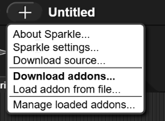

# Sparkle

[History](README.md#History) | [License](LICENSE)

A modding framework for Snap!, made by [@tethrarxitet](https://forum.snap.berkeley.edu/u/tethrarxitet), [@codingisfun2831t](https://forum.snap.berkeley.edu/u/codingisfun2831t), [@e016](https://forum.snap.berkeley.edu/u/d016), and [@PPPDUD](https://www.github.com/PPPDUD) among others.

## Loading in browser
For now, Sparkle does not have any pages for it on common browser extension stores, so you will have to load it manually for your browser.

### Firefox
Go to `about:debugging`, go to `This Firefox`, click `Load Temporary Add-on...` and select the `manifest.json` file in this directory. Now, whenever you launch Snap! you should see the new addon button.

### Chrome
First, go to [chrome://extensions/](chrome://extensions/). There should be a "Developer mode" options. Simply press that, and then go to the "Manage Extensions" option. There should now be a "Load unpacked" button at the top left. Import your Sparkle folder in there, and see the results.

### Jameson
[Jameson](https://mojavesoft.net/ide/) comes with Sparkle by default and does not require a browser extension.

### Bookmarklet
To install Sparkle as a bookmarklet, download the file labeled `sparkle.bookmarklet.js` from a Sparkle release in the Releases tab, copy its contents, and then paste them as the website URL for a bookmark. Now, you can activate Sparkle at any time by clicking on the bookmark.

### Pasting code into the console
To run Sparkle by pasting JavaScript code into your console, download the file named `sparkle.min.js` from the Releases tab, copy its contents, enter your browser's JavaScript console (F12 on most browsers), and then paste the code.

### Installing as a userscript
Beginning with v0.12, Sparkle contains native support for installation as a userscript.

#### TamperMonkey/GreaseMonkey/ViolentMonkey
To install Sparkle as a userscript in a *Monkey userscript manager, download the `sparkle.js` file from the Releases tab and add it to your preferred userscript manager. (Exact steps will vary depending on which extension you're using; consider searching for more specific instructions online.)

#### Bonobo
To install Sparkle in [Bonobo](https://github.com/bonobo-devs/bonobo/tree/main), download the `sparkle.bonobo` file from the Releases tab and select the downloaded file in your Bonobo userscript management window (opened by clicking the extension icon).

## How to use
When launching Snap! or one of its forks with Sparkle installed, you should see a new button being added to the title bar:

If you were to click on the addon button, you'll see this menu popup:

Here is what each of those options do:

* `About Sparkle...` - Display a dialog containing info about Sparkle
* `Sparkle Settings...` - Display a menu allowing you to change Sparkle's settings
* `Download Source` - Redirects to the latest Github release of Sparkle

* `Download Addons...` - Display an importer for Sparkle's library of approved addons
* `Load addon from file...` - Load mod from a file on your computer

* `Manage loaded addons...` - Display a menu allowing you to see info or delete currently-loaded addons

For mod creators, check out [the API documentation](doc/API.md) so you can make your own addons.

## History
In 2025, @codingisfun2831t started work on a piece of software called [Snap!Mods](https://forum.snap.berkeley.edu/t/snap-mods/20347). Later on; he, with the help of @tethrarxitet, started work on a successor project, named [Crackle](https://github.com/CrackleTeam/CrackleSDK).

Shortly after, @pppdud began writing the first version of Sparkle (which mostly took code from Crackle and simplified the UI), now known as `sparkle-old`. After getting frustrated by the rapid pace of feature-breaking development at Crackle, he refocused and started attempting to send his changes upstream.

On March 24th, 2026, @pppdud, @codingisfun2831t, and @e016 discussed the future of Crackle. The owner at that point, @tethrarxitet, was inactive, so the other developers agreed to create a new fork, which is now known as the modern-day Sparkle.

Under the leadership of the Mojavesoft Group, Sparkle has obtained several features, like [Jameson](https://mojavesoft.net/ide/) support, that were requested multiple times but were never added to the Crackle source code.

And then, on June 6th, 2026, via issue #59, the Sparkle team moved to a separate organization, [sparkle-devs](https://github.com/sparkle-devs), following multiple requests from @codingisfun2831t.

## A note about maintainable free software
This project is governed by [The Maintainable Free Software Policy v1.0](https://github.com/Mojavesoft-Group/free-software-policies/blob/main/1.0/README.md).
The TMFSP is an all-in-one document that provides a basic set of rules for free software projects everywhere, so that they can be kept maintainable for years to come. To learn more about the rules of this project, click the link above.
